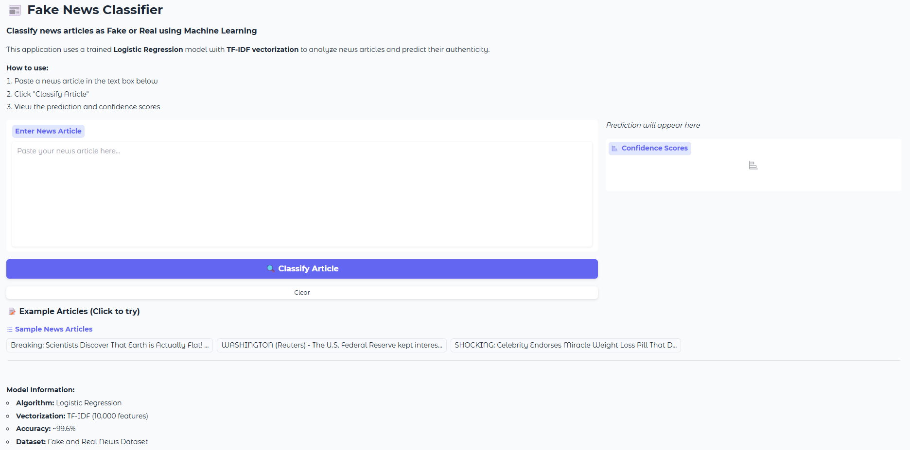

# Fake News Classifier & Deployment

A complete NLP machine learning project that classifies news articles as **Fake** or **Real** using Natural Language Processing and deploys the model as an interactive web application.

## Project Overview

This project demonstrates the end-to-end process of building, training, and deploying a machine learning model for fake news detection:

1. **Exploratory Data Analysis (EDA)** - Analyze text patterns and distributions
2. **Model Training** - Train and compare multiple classification models
3. **Web Deployment** - Deploy the best model using Gradio

## Dataset

- **Source:** Fake and Real News Dataset
- **Features:** News article text
- **Target:** Binary classification (Fake / Real)
- **Total Samples:** 44,898 articles
  - Fake: 23,481 (52.3%)
  - Real: 21,417 (47.7%)

### Data Distribution
The dataset is **balanced**, with roughly equal representation of both classes, which is ideal for training classification models.

## Key Findings from EDA

### 1. Text Length Analysis
- **Fake articles** tend to be **longer** on average
  - Fake: ~4,003 characters
  - Real: ~2,394 characters
- Fake articles contain more emotionally charged and sensational language
- Real articles use more formal, factual language

### 2. Vocabulary Patterns
- **Top Fake Article Words:** trump, said, people, state, clinton
- **Top Real Article Words:** said, trump, people, president, reuters

### 3. Data Quality
- ✅ No missing values
- ✅ No duplicate entries
- ✅ Balanced dataset (52.3% vs 47.7%)

## Model Comparison

| Model | Accuracy | Precision | Recall | F1-Score |
|-------|----------|-----------|--------|----------|
| **Multinomial Naive Bayes** | 0.9694 | 0.9697 | 0.9694 | 0.9694 |
| **Logistic Regression** | 0.9962 | 0.9962 | 0.9962 | 0.9962 |

## Final Model

**Model:** Logistic Regression  
**Accuracy:** 99.62%  
**F1-Score:** 0.9962

### Why Logistic Regression?

✅ **Superior Performance:** Outperforms Naive Bayes by ~2.7% in accuracy  
✅ **No Feature Independence Assumption:** Unlike Naive Bayes, Logistic Regression doesn't assume features are independent  
✅ **Better Handling of Correlations:** More effective with correlated features common in text data  
✅ **Probability Estimates:** Provides reliable confidence scores for predictions  

## Preprocessing Pipeline

1. **Text Cleaning:**
   - Lowercase conversion
   - Punctuation removal
   - Special character removal
   - Whitespace normalization

2. **Vectorization:**
   - TF-IDF (Term Frequency-Inverse Document Frequency)
   - Max features: 10,000
   - N-gram range: (1, 2) - unigrams and bigrams
   - Stopword removal: English stopwords
   - Min document frequency: 2

## Web Application

The model is deployed using **Gradio**, providing an interactive web interface where users can:
- Paste news articles for classification
- View predictions (Fake/Real)
- See confidence scores for each class
- Try example articles

### Features:
- ✅ Clean, intuitive UI
- ✅ Real-time predictions
- ✅ Confidence scores visualization
- ✅ Pre-loaded example articles
- ✅ Model information display

## Project Structure

```
fake-news-classifier/
│
├── data/
│   └── fake_and_real_news.csv      # Dataset
│
├── notebooks/
│   ├── 1_eda.ipynb                 # Exploratory Data Analysis
│   └── 2_training.ipynb            # Model Training & Comparison
│
├── models/
│   └── best_model.pkl              # Trained pipeline (TF-IDF + Logistic Regression)
│
├── screenshots/
│   └── gradio_interface.png        # Web app screenshot
│
├── app.py                          # Gradio deployment script
├── requirements.txt                # Python dependencies
└── README.md                       # Project documentation
```

## Installation & Setup

### 1. Clone the Repository
```bash
git clone https://github.com/jahidhasansagor-buet/machine-learning-projects.git
cd machine-learning-projects
cd fake-news-classifier
```

### 2. Create Virtual Environment (Optional but Recommended)
```bash
python -m venv venv
source venv/bin/activate  # On Windows: venv\Scripts\activate
```

### 3. Install Dependencies
```bash
pip install -r requirements.txt
```

### 4. Download NLTK Stopwords
```python
import nltk
nltk.download('stopwords')
```

## Running the Notebooks

### 1. EDA Notebook
```bash
jupyter notebook notebooks/1_eda.ipynb
```

This notebook contains:
- Data loading and inspection
- Label distribution analysis
- Text length analysis (character and word count)
- Most common words visualization
- Statistical comparisons

### 2. Training Notebook
```bash
jupyter notebook notebooks/2_training.ipynb
```

This notebook contains:
- Data preprocessing
- TF-IDF vectorization
- Training Multinomial Naive Bayes
- Training Logistic Regression
- Model comparison with confusion matrices
- Best model selection and saving

## Running the Web App

### Start the Gradio Application
```bash
python app.py
```

### Using the App:
1. Open the URL in your browser
2. Paste a news article in the text box
3. Click "Classify Article"
4. View the prediction and confidence scores

## Screenshots



## Technologies Used

- **Python 3.8+**
- **Data Analysis:** Pandas, NumPy
- **Visualization:** Matplotlib, Seaborn
- **NLP:** NLTK
- **Machine Learning:** Scikit-learn
- **Web Framework:** Gradio
- **Model Serialization:** Joblib

## Model Performance Details

### Confusion Matrix (Logistic Regression)

|                | Predicted Fake | Predicted Real |
|----------------|---------------|---------------|
| **Actual Fake** | 4,669         | 27            |
| **Actual Real** | 7             | 4,277         |

### Classification Metrics:

**For Fake News:**
- Precision: 0.998
- Recall: 0.994
- F1-Score: 0.996

**For Real News:**
- Precision: 0.994
- Recall: 0.998
- F1-Score: 0.996

## Limitations & Considerations

1. **Dataset Specificity:** The model is trained on a specific dataset and may not generalize perfectly to all news sources
2. **Language:** Currently supports English-language articles only
3. **Context:** The classifier analyzes text patterns, not factual accuracy
4. **Verification:** Always verify important information from multiple reliable sources

## Future Improvements

- [ ] Add support for multiple languages
- [ ] Implement BERT/Transformer-based models for improved accuracy
- [ ] Add source credibility checking
- [ ] Include fact-checking API integration
- [ ] Deploy to cloud platforms (AWS, GCP, Azure)
- [ ] Add URL input for direct article fetching
- [ ] Implement user feedback mechanism

## License

This project is licensed under the MIT License - see the LICENSE file for details.

## Acknowledgments

- Dataset source: [Fake and Real News Dataset](https://www.kaggle.com/datasets)

## References

- Scikit-learn Documentation: https://scikit-learn.org/
- Gradio Documentation: https://gradio.app/
- NLTK Documentation: https://www.nltk.org/

