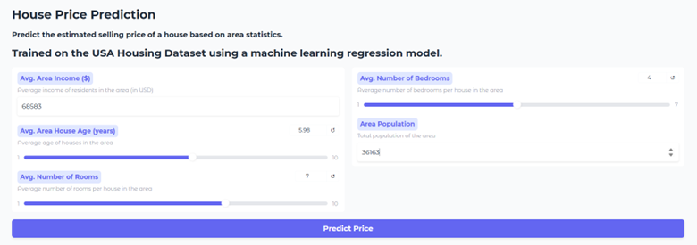

# 🏠 House Price Prediction & Deployment

## Overview
A complete machine learning project that predicts US house prices based on area-level statistics.
The project covers exploratory data analysis, training and comparing multiple regression models,
and deploying the best model as an interactive web app using Gradio.

## Dataset
- **Source:** USA Housing Dataset
- **Features used:**
  - Avg. Area Income
  - Avg. Area House Age
  - Avg. Area Number of Rooms
  - Avg. Area Number of Bedrooms
  - Area Population
- **Target:** House Price
- **Total samples:** 5,000

## Model Comparison

| Model | Train R² | Test R² | Test MSE |
|-------|----------|---------|----------|
| Linear Regression | — | — | — |
| Ridge Regression (alpha=10) | — | — | — |
| Lasso Regression (alpha=100) | — | — | — |
| Polynomial (deg=2) + Ridge | — | — | — |
| KNN (k=5) | — | — | — |
| KNN (k=10) | — | — | — |

> ⚠️ Fill in the actual values after running `2_training.ipynb`.

## Final Model

**Model:** *(fill in after training)*  
**Test R²:** *(fill in)*  
**Test MSE:** *(fill in)*  

**Why this model?**  
*(Explain based on your results — e.g., "Best Test R² with no significant overfitting.
Polynomial features captured slight non-linearity observed in EDA scatter plots.
Ridge regularization prevented overfitting on expanded feature space.")*

## Web Application

Deployed using [Gradio](https://gradio.app).

### Screenshots



## Installation

```bash
git clone https://github.com/YOUR_USERNAME/house-price-prediction
cd house-price-prediction
pip install -r requirements.txt
```

## Usage

**Run EDA notebook:**
```
notebooks/1_eda.ipynb
```

**Run Training notebook:**
```
notebooks/2_training.ipynb
```

**Launch web app:**
```bash
python app.py
```

## Project Structure

```
house-price-prediction/
├── data/
│   └── usa_housing.csv
├── notebooks/
│   ├── 1_eda.ipynb
│   └── 2_training.ipynb
├── app.py
├── models/
│   └── best_model.pkl
├── screenshots/
│   └── gradio_interface.png
├── README.md
└── requirements.txt
```

## Technologies Used

- Python
- Pandas, NumPy, Matplotlib, Seaborn
- Scikit-learn
- Gradio
- Joblib
