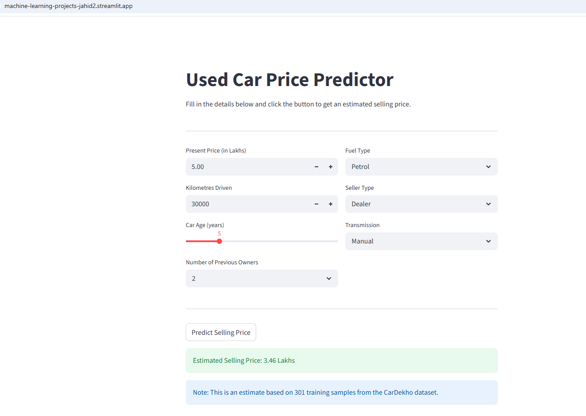

# Used Car Price Prediction

## Overview

A machine learning project that predicts the selling price of used cars based on vehicle attributes like present price, kilometres driven, fuel type, and more. Built five regression models, compared them, and deployed the best one as a Streamlit web app.

## Dataset

- Source: [Kaggle — Vehicle Dataset from CarDekho](https://www.kaggle.com/datasets/nehalbirla/vehicle-dataset-from-cardekho)
- Features used: Present_Price, Kms_Driven, Car_Age, Fuel_Type, Seller_Type, Transmission, Owner
- Target: Selling_Price (in Lakhs)
- Total samples: 301

## Key EDA Findings

- Present_Price has the strongest correlation with Selling_Price (0.88) — it's the most useful feature
- Diesel cars generally sell for more compared to Petrol or CNG
- Cars older than 10 years show a clear drop in resale value
- Manual transmission dominates the dataset (261 out of 301 cars)
- One extreme outlier in Kms_Driven (500,000 km) was capped at 200,000

## Model Comparison

| Model             | Train R2 | Test R2 | Test RMSE |
|-------------------|----------|---------|-----------|
| Linear Regression | 0.8887   | 0.8490  | 1.8652    |
| Ridge             | 0.8886   | 0.8496  | 1.8611    |
| Random Forest     | 0.9848   | 0.9595  | 0.9663    |
| XGBoost           | 1.0000   | 0.9568  | 0.9975    |
| LightGBM          | 0.8853   | 0.8780  | 1.6767    |

## Final Model

**Model:** Random Forest (n_estimators=200)  
**Test R2:** 0.9595  
**Test RMSE:** 0.9663  
**Why this model:** Random Forest gave the best generalization. XGBoost had a Train R2 of 1.0, which is overfitting — it memorized the training data. Random Forest's train/test gap is small and its test performance is the best of the non-overfitting models.

## Web Application

Deployed using Streamlit.

[Live Demo](https://machine-learning-projects-jahid2.streamlit.app/)

### Screenshots



## Installation

```bash
git clone https://github.com/jahidhasansagor-buet/machine-learning-projects.git
cd machine-learning-projects/used-car-price-prediction
pip install -r requirements.txt
```

## Usage

```bash
streamlit run app.py
```

## Technologies Used

- Python
- Pandas, NumPy, Matplotlib, Seaborn
- Scikit-learn, XGBoost, LightGBM
- Streamlit
